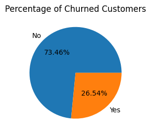

# 📊 Customer Churn Analysis

## 📌 Project Overview

Customer churn has a direct impact on business revenue and customer lifetime value. This project focuses on analyzing customer churn patterns using **exploratory data analysis (EDA)** and **data visualization** to identify the key factors contributing to customer attrition.

The analysis highlights churn behavior across **tenure**, **customer demographics**, **services**, and **contract types**, supported by clear, percentage-based visualizations.

---

## 🎯 Objectives

* Analyze the overall customer churn rate
* Identify high-risk customer segments
* Understand churn trends based on tenure and contract types
* Visualize churn using clear and interpretable charts
* Provide actionable business insights

---

## 🛠️ Tools & Technologies

* **Python**
* **Pandas**
* **NumPy**
* **Matplotlib**
* **Seaborn**
* **Jupyter Notebook**

---

## 🧹 Data Preprocessing

* Handled missing values in **Total Charges** by replacing blank values with `0` for customers with zero tenure
* Converted categorical fields (e.g., *Senior Citizen*) into readable labels
* Ensured data consistency before visualization

---

## 📂 Project Structure

```
Customer-Churn-Analysis/
│── 📄 Churn_Analysis.ipynb
│── 📄 README.md
│── 📁 images/
│   ├── churn_rate.png
│   ├── tenure_churn.png
│   ├── contract_churn.png
│── 📄 dataset.csv   (if applicable)
```

## 📊 Key Visualizations & Insights

### 🔹 Overall Churn Distribution

* **26.54%** customers have churned
* **73.46%** customers are retained



➡️ This shows that **approximately 1 in 4 customers leaves the service**, making churn reduction a key business priority.

---

### 🔹 Churn by Tenure

* Customers with **0–12 months tenure** show the **highest churn percentage**
* Churn decreases significantly as tenure increases
* Customers with **36+ months tenure** demonstrate strong retention


➡️ The **first year of customer experience** is critical for retention.

---

### 🔹 Churn by Contract Type

* **Month-to-month contract customers contribute the highest churn**
* **1-year and 2-year contracts** significantly reduce churn


➡️ Long-term contracts play a major role in improving customer loyalty.

---

### 🔹 Churn by Services

* Customers without services such as **Online Security, Tech Support, or Device Protection** show higher churn
* Customers subscribed to **multiple services** have lower churn rates


➡️ Service bundling increases customer engagement and reduces churn risk.

---

## 📈 Key Findings (Highlighted)

* **Overall churn rate: 26.54%**
* **Highest churn occurs in the first 12 months**
* **Senior citizens churn more than non-senior customers**
* **Month-to-month contracts dominate churn cases**
* **Customers using fewer services are more likely to churn**

---

## 💡 Business Recommendations

* Improve onboarding and engagement for **new customers**
* Promote **long-term contracts** to reduce churn risk
* Encourage **service bundling** to increase customer value
* Design targeted retention strategies for **high-risk segments**

---

## 🚀 Future Enhancements

* Build a **predictive churn model**
* Perform feature engineering for deeper insights
* Create an interactive dashboard using **Power BI / Tableau**
* Deploy analysis as a web application

---

## 📬 Contact

Feel free to raise an issue or connect if you have feedback or suggestions.

---
